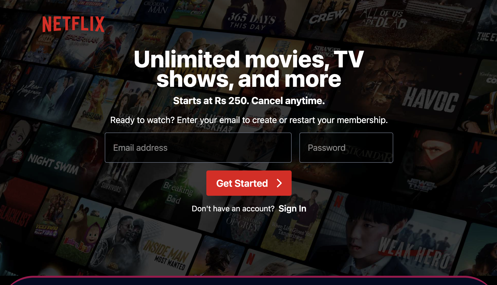
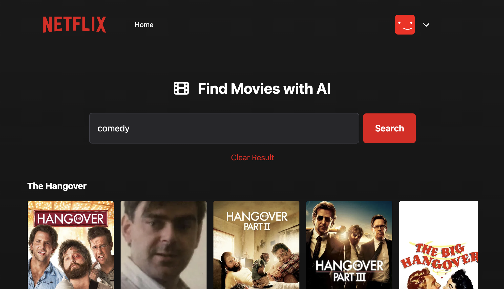
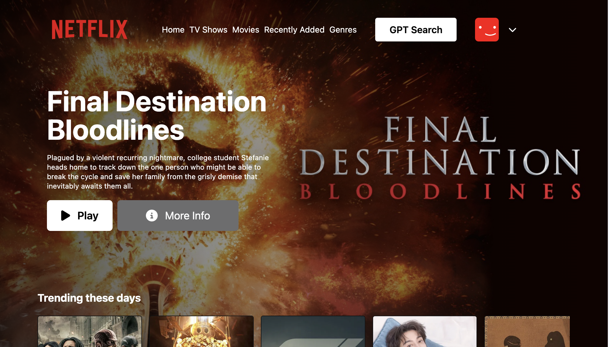

# Netflix GPT 🎬🔍

A responsive, AI-powered movie recommendation app built with **React**, **Redux**, **Tailwind CSS**, and **Firebase**. Netflix GPT mimics the Netflix UI and integrates **OpenAI** to provide smart movie recommendations via chat-based search.

> 🚀 **Live Demo**: [netflixgpt-f6131.web.app](https://netflixgpt-f6131.web.app/)

---

## 🔥 Features

- 🔐 **Authentication** using Firebase
- 📺 **Netflix-like UI** with dynamic video backgrounds
- 💬 **ChatGPT-powered search** for movie recommendations
- 🎨 **Responsive design** for all screen sizes
- 🧠 **Smart movie search** using OpenAI GPT
- ⚙️ **State Management** with Redux Toolkit

---

## 🛠️ Tech Stack

- **React**
- **Redux Toolkit**
- **Tailwind CSS**
- **Firebase Authentication**
- **OpenAI GPT API**
- **TMDB API**

---

## 📸 Screenshots

> Screenshots of the app:

### 📝 Signup Page

### 🔐 Login Page

### 🎬 Main Browser UI

### 🤖 GPT Movie Search

